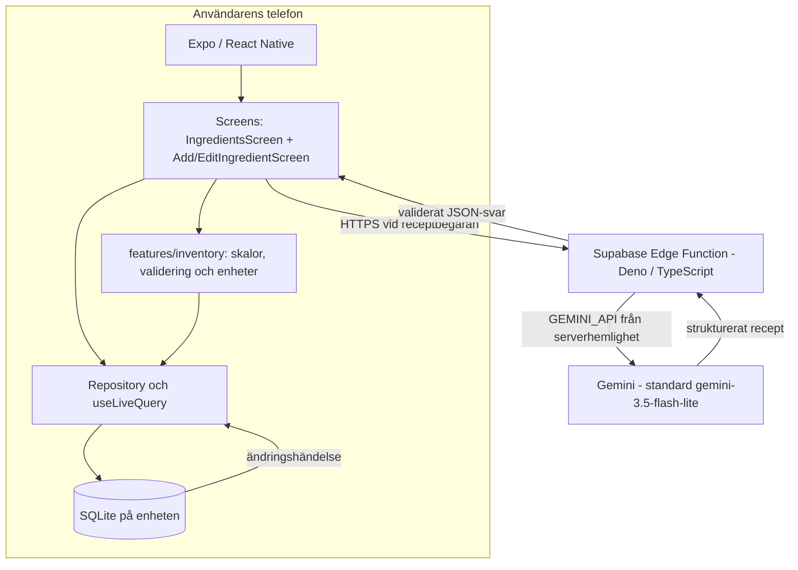

# Arkitektur — lokal databas och implementerad AI-gateway

**Status (2026-11-25, sprint 3):** Datalagret och matförrådets UI är mergade till `main` via PR #122. US-03/US-04, numeriskt tangentbord och skalor är implementerade. Receptspåret finns i kod på branchen `screen-and-page-for-generate-recipe`: Edge Function, modal `/generate-recipe` och `/recipe`-skärm. GitHub-issuesen #143/#129 är öppna tills PR:en mergas; #135 och missbruksskydd (#138) är kvar.

## Översikt


```mermaid
flowchart TD
  subgraph Phone[Användarens telefon]
    UI[Expo / React Native]
    S[Screens: IngredientsScreen + Add/EditIngredientScreen]
    V[features/inventory: skalor, validering och enheter]
    R[Repository och useLiveQuery]
    DB[(SQLite på enheten)]
    UI --> S
    S --> V
    S --> R
    V --> R
    R --> DB
    DB -->|"ändringshändelse"| R
  end
  S -->|"HTTPS vid receptbegäran"| Edge[Supabase Edge Function - Deno / TypeScript]
  Edge -->|"GEMINI_API från serverhemlighet"| AI[Gemini - standard gemini-3.5-flash-lite]
  AI -->|"strukturerat recept"| Edge
  Edge -->|"validerat JSON-svar"| S
```

Hela flödet finns i kod på feature-branchen.

**Två olika ansvar:** SQLite lagrar *data på telefonen*. Supabase används **endast** för att köra en Edge Function som säkert anropar AI; ingen Supabase PostgreSQL-databas krävs för MVP:n.

## 1. Matförrådet: helt lokalt

Implementerat i sprint 1–2:

- Inventariet sparas per appinstallation med `expo-sqlite` i databasen `imhungry.db`.
- Drizzle ORM ligger bakom `features/inventory/repository.ts`. Skärmarna innehåller ingen SQL.
- `IngredientsScreen` läser via `useInventoryItems` (`useLiveQuery`). Listan uppdateras automatiskt när `inventory_items` ändras och visar laddning, tomt läge och fel.
- `AddIngredientScreen` använder numeriskt tangentbord, en skalväljare (`scales.ts`) och `parseIngredientInput`. Skalor räknas om med flyttalsavrundning till basenheterna g/ml/st innan `useAddIngredient` sparar. Formuläret öppnas som modal från fliken **Råvaror**.
- `EditIngredientScreen` öppnas som modal via `/edit-ingredient?id=<id>`, validerar med `parseQuantityInput` och skriver med `useUpdateIngredient`.
- `IngredientsScreen` tar bort råvaror via `useRemoveIngredient` efter bekräftelse (`Alert.alert` på native, `window.confirm` på webb).
- Appen är låst till ljust läge (`userInterfaceStyle: "light"`) och använder primärfärgen `#208AEF` i hela flödet.
- SQLite-begränsningar skyddar lagrade värden även om TypeScript-validering missas: `quantity > 0` och `unit in ('g', 'ml', 'qty')`.
- Drizzle Kit skapar granskade, versionshanterade migrationer som körs vid appstart innan databasfrågor utförs.
- Två migrationer finns: `0000_freezing_rick_jones.sql` skapar tabellen och `0001_woozy_the_order.sql` lägger till `CHECK`-begränsningarna och bevarar befintliga rader.
- Inventariet fungerar utan internet. Det finns **ingen** automatisk säkerhetskopia, kontosynk eller överföring mellan telefoner.

**Implementerat:** receptflöde och Supabase Edge Function. Mat-humör (US-06) är uppskjutet till efter MVP. Startsidan visar **Im hungry** och tre instruktionssteg.

## 2. Receptbegäran: implementerad

**Beslut 2026-11-19:** `gemini-3.8-flash` är designvalet; koden defaultar till `gemini-3.5-flash-lite` och kan sätta primär/reservmodell med `GEMINI_MODEL`/`GEMINI_BACKUP_MODEL`. API-request v1 innehåller **endast `ingredients`**, och lyckat svar innehåller exakt **`title`, `ingredients`, `steps`, `estimatedCookingTime`**. Se [AI-integrationsdesignen och kontrakt v1](ai-integration.md) för JSON-fält, basenheter (`g`, `ml`, `qty`), felkoder och mängdkontroll. Flödet fungerar så här:

1. Användaren trycker på fliken **Generate Recipe**, som öppnar modalen; inga preferensval krävs i MVP.
2. Mobilappen hämtar ett **ögonblicksutdrag** ur lokal SQLite. **Endast ingredienslistan** (ID, namn, mängd och basenhet) skickas över HTTPS.
3. Supabase Edge Function (Deno/TypeScript) validerar indata, begränsar tillåtna fält och rimlig storlek och anropar AI-leverantören med API-nyckel från serverlagrad hemlighet.
4. Funktionen validerar AI-svarets struktur och grundläggande receptbegränsningar. Den skickar tillbaka ett JSON-resultat eller ett tydligt fel (t.ex. timeout, tjänsten otillgänglig, kvot nådd).
5. Appen validerar att föreslagna ingredienser refererar till **befintliga inventory-ID:n med korrekta basenheter och tillgängliga sammanlagda mängder**, först mot snapshoten och sedan mot aktuellt lager om något hunnit ändras. Om receptet inte är giltigt visas en begriplig fel-/alternativvy. Ingenting dras automatiskt från lagret.

**Begränsning:** Edge Function har ingen direkt insyn i SQLite och kan därför **inte oberoende verifiera telefonens verkliga saldo**. Den kan validera mot den inskickade listan. Appen ansvarar för kontrollen mot lagret på enheten och eventuell förändring sedan begäran gjordes.

## 3. Säkerhet och missbruksskydd

- **Aldrig:** Lägg en privat Gemini/OpenAI-nyckel i React Native-kod, Git, apppaketet eller `EXPO_PUBLIC_*`.
- **Serverhemligheter:** Lagra AI-nyckeln via Supabases hantering av Edge Function-secrets.
- **Ingen inloggning i MVP:n:** En funktion som går att anropa utan användarautentisering kan utnyttjas av obehöriga. En publik/`verify_jwt = false`-konfiguration är **inte** ett missbruksskydd. Innan funktionen exponeras publikt måste ni bestämma praktiska skydd som rate limiting, kostnadskvoter, övervakning och lämplig anropskontroll. En publik/anon-nyckel i appen är inte hemlig.
- **Indatavalidering:** Begränsa antal råvaror, namn- och textlängder samt mängder; avvisa oväntade fält och osäkert stora anrop. Request v1 har inget `mood`-fält.
- **Svar:** Begär strukturerat JSON från Gemini och validera mot [kontrakt v1](ai-integration.md). Kontrollera ID, enhet och totalmängd mot lagerdata; modellens resultat är opålitligt tills det verifierats.
- **Dataminimering:** Skicka inte identitet, enhets-ID eller andra personuppgifter för receptbegäran när det inte behövs.
- **Offline-fel:** Visa tydligt när AI-funktionen inte kan nås. Matförrådet ska fortsätta fungera.

## 4. Mappstruktur

```text
mobile/
  src/
    app/                       # Expo Router: endast routes
      _layout.tsx              # Rot-Stack + DatabaseProvider + RecipeProvider
      add-ingredient.tsx       # Modal route
      edit-ingredient.tsx      # Modal route
      generate-recipe.tsx      # Tunn modal route
      recipe.tsx               # Tunn receptroute
      (tabs)/
        _layout.tsx            # Hem + Generate Recipe + Råvaror
        index.tsx              # Hem: rubrik och instruktioner
        generate.tsx           # Web-fallback till modalen
        ingredients/index.tsx  # Tunn route
    screens/                   # Skärmkomponenter
      IngredientsScreen.tsx
      AddIngredientScreen.tsx
      EditIngredientScreen.tsx
      GenerateRecipeModalScreen.tsx
      GeneratedRecipeScreen.tsx
    features/
      inventory/               # Enheter, skalor, validering, repository, 4 tester
      recipes/                 # generate, context, view-model, 2 tester
    db/
      client.ts                # Memoiserad Drizzle-instans (useDatabase)
      provider.tsx             # SQLiteProvider + migrationer vid start
      schema.ts                # Drizzle-schema (sanningskälla)
  drizzle/                     # Genererade SQL-migrationer och metadata
supabase/functions/
  generate-recipe/             # Deno/TypeScript, validering + AI-gateway
```

Routes i `src/app/` hålls tunna: de importerar skärmar från `src/screens/` och domänlogik från `src/features/`. `db/` innehåller allt som rör databasen, så skärmar och features slipper SQL. `features/inventory/` har det delade datalagret för matförrådet; `features/recipes/` har receptanrop, context och visningslogik.

## 5. Teknisk verifiering

**Implementerat:**

- Lista, tomt läge och felvy är implementerade mot lokal SQLite.
- Lägga till, ändra mängd och bekräftad borttagning är implementerade med delad validering och repository-hooks.
- Skalor räknas om och avrundas till basenheter.
- Receptflödet har modal, laddning/fel, snapshot och re-check mot lagret; `/recipe` visar de fyra kontraktfälten.

**Automatiskt verifierat:**

- Ogiltig mängd/enhet stoppas av validering och SQLite `CHECK`-begränsningar; skalor och flyttalsavrundning täcks av egna tester.
- Migration från tom installation och från föregående databasversion bevarar existerande data.
- Receptkontrakt, dubblettavvisning, lagerkontroll och visningsfiltrering täcks av `generate.test.ts` och `view-model.test.ts`.
- Sex Vitest-testfiler / 34 tester. CI kör lint, typkontroll, Vitest och `deno test` för Edge Function.

**Manuellt verifierat i sessionen:**

- Receptgenerering med riktig Gemini-nyckel ger ett recept i appen.

**Att kontrollera i samband med PR-granskning:**

- Att listan uppdateras direkt efter save och att datan finns kvar efter appomstart.
- Att flödet fungerar på både native och webb, inklusive modalens stängning och tangentbord.
- Att GitHub Actions är grönt på den uppdaterade branchen och att inga hemligheter förekommer i byggd kod eller Git.

## Beslut och externa referenser

- [Beslutsloggen](beslutslogg.md), beslut 03, 06–07 · [AI-integrationsdesign och API-kontrakt](ai-integration.md) (#125).
- [MVP](mvp.md) · [Databasschema](databasschema.md) · [Sprint 1](sprintar/sprint-1/planning.md).
- [Expo SQLite](https://docs.expo.dev/versions/v58.0.0/sdk/sqlite/) · [Drizzle / Expo SQLite](https://orm.drizzle.team/docs/sqlite/connect-expo-sqlite) · [Supabase Edge Functions](https://supabase.com/docs/guides/functions).

**Senast uppdaterad:** 2026-11-25 (sprint 3; receptflöde implementerat på feature-branch).
